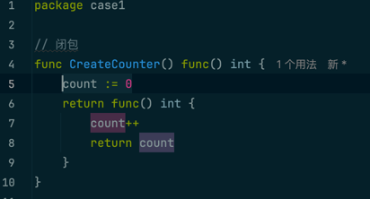
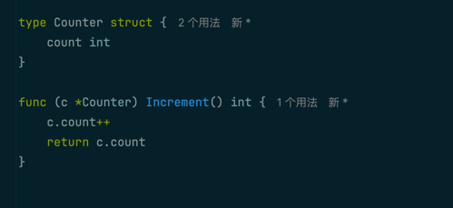
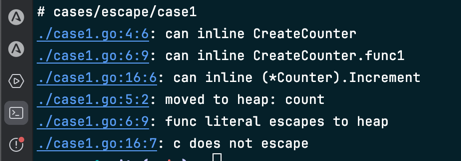
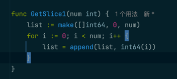
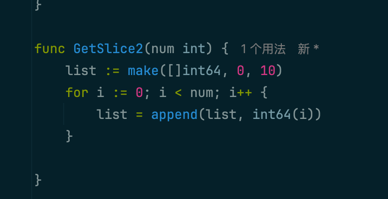
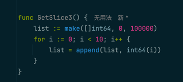
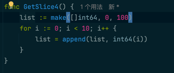

## go的逃逸分析

### 闭包
运行case1下面的程序
闭包写法



不是闭包的写法



最后运行 ```go build -gcflags '-m'```


 逃逸原因：
闭包引用了外部变量count
1. 优化策略，改变成非闭包的写法


### 切片
#### 变量大小不确定时会发生逃逸 

运行case2的案例



运行case2的优化



运行结果


原因：切片的长度和容量，虽然通过声明的变量num来指定了，但在编译阶段是未知的，并不确定num的具体值，所以会逃逸，将内存分配到堆上。


#### 变量太大也会发生逃逸

运行案例



运行优化



逃逸分析结果


#### channel
向 channel 发送指针数据。因为在编译时，不知道channel中的数据会被哪个 goroutine 接收，因此编译器没法知道变量什么时候才会被释放，因此只能放入堆中。

优化前再case3.go中

优化后在case3_optimize.go中，接收结构体
